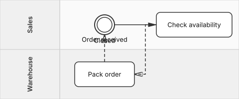
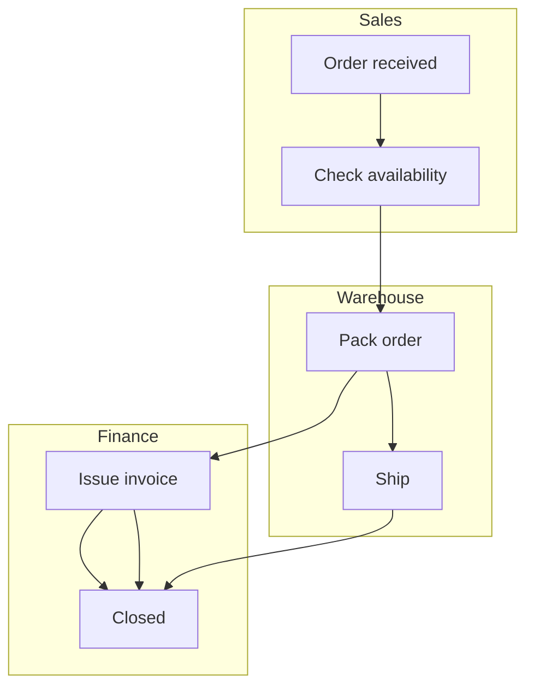

# LaneFlow

> A lightweight, text-based notation for process diagrams **with lanes**.
> Think Mermaid, but designed from the ground up for swimlanes.

**Status:** v0.2 — Stable specification, reference parser, and reference renderer.
**License:** Specification under [CC BY 4.0](LICENSE). Code under [MIT](LICENSE-CODE).

---

## Why LaneFlow?

Mermaid.js is great for flowcharts and sequence diagrams, but it has **no
native swimlane notation**. The common workaround — abusing `subgraph` inside
a flowchart — breaks down as soon as a process grows beyond a handful of
steps, and there is no concept of *message flow* between participants.

Existing alternatives are either:

- **BPMN 2.0** — powerful but heavy. XML-based, dozens of element types,
  hard to write by hand, painful in code review.
- **PlantUML activity diagrams** — closer, but require a separate Java
  toolchain and don't model cross-lane communication cleanly.

LaneFlow fills the gap with a small, regular, diff-friendly syntax:

```laneflow
laneflow v0.1

lane Sales      "Sales"
lane Warehouse  "Warehouse"

Sales:     start  (Order received)
Sales:     check  [Check availability]
Warehouse: pack   [Pack order]
Sales:     done   ((Closed))

start --> check
check --> pack
pack  --> done
```

`Sales: check --> pack` crosses a lane boundary, so the parser classifies
it as a **message flow** automatically. The author never declares it.

Rendered with the reference renderer (`@laneflow/renderer`, v0.2):

<picture>
  <source media="(prefers-color-scheme: dark)" srcset="docs/images/readme-hero-dark.svg">
  
</picture>

### Before / after

A three-lane order process in Mermaid (workaround with `subgraph`):



The same process in LaneFlow:

```laneflow
laneflow v0.1

lane Sales
lane Warehouse
lane Finance

Sales:     start    (Order received)
Sales:     check    [Check availability]
Warehouse: pack     [Pack order]
Warehouse: ship     [Ship]
Finance:   invoice  [Issue invoice]
Finance:   done     ((Closed))

start --> check --> pack --> ship
pack --> invoice --> done
ship --> done
```

Lanes are first-class. Order of declaration is the order on the diagram.
Cross-lane arrows are message flow. The file diffs cleanly when the
process changes.

---

## Design principles

LaneFlow targets two audiences equally: humans reviewing diagrams in pull
requests, and **LLMs generating diagrams from natural-language sources**
(e.g. parsing a process description out of a PDF).

That second audience drives the most important design rule:

> **One way to express each thing.** Regularity beats sugar.

Concretely:

- Sections appear in a **fixed order**: header → (direction) → lanes →
  nodes → flows.
- Lanes MUST be declared up front.
- Nodes have explicit ids; flows reference ids, not labels.
- Sequence vs. message flow is **derived**, never declared.
- No optional shorthand that creates two ways to write the same thing.

---

## Quick reference

| You want…                       | You write…              |
|---------------------------------|-------------------------|
| Start / intermediate event      | `(text)`                |
| End event                       | `((text))`              |
| Task / activity                 | `[text]`                |
| Decision gateway                | `<text>`                |
| Declare a lane                  | `lane Sales "Sales"`    |
| Declare a node                  | `Sales: check [Check]`  |
| Plain arrow                     | `a --> b`               |
| Labeled arrow                   | `a -- yes --> b`        |
| Comment                         | `# anything`            |

The full grammar lives in [`docs/grammar.ebnf`](docs/grammar.ebnf) and the
formal specification in [`SPEC.md`](SPEC.md).

---

## Repository layout

```
SPEC.md                  Formal specification (normative)
docs/grammar.ebnf        Grammar — source of truth for syntax
docs/DESIGN_DECISIONS.md ADR-style log of why the syntax is what it is
examples/                Worked .laneflow examples
impl/                    Reference parser (TypeScript, MIT)
impl-render/             Reference renderer (TypeScript, MIT)
ai/                      Materials for LLM-based assistants
.claude/skills/laneflow/ Claude Code skill (generate / review)
CONTRIBUTING.md          How to propose changes (RFC process)
CODE_OF_CONDUCT.md       Community standards
CHANGELOG.md             Versioned spec history
LICENSE                  CC BY 4.0 (specification & docs)
LICENSE-CODE             MIT (source code under impl/ and future code)
```

---

## Roadmap

LaneFlow v0.2 is complete: published specification, LLM authoring
guide, reference parser, and reference renderer.

- **Step 1 — Specification (done).** Locked down the v0.1 syntax,
  published the spec and worked examples, set up the RFC process.
- **Step 2 — AI authoring guide (done).** Materials that let
  assistants like Claude Code reliably generate and read LaneFlow:
  authoring guide, condensed system prompt, error-recovery catalog,
  five few-shot examples, and a Claude Code skill. See `ai/` and
  `.claude/skills/laneflow/`.
- **Reference parser (done).** TypeScript implementation at
  [`impl/`](impl/) — `parse()` / `validate()` API plus a `laneflow`
  CLI. MIT-licensed, zero runtime dependencies. The specification
  itself stays under CC BY 4.0 regardless of the implementation
  license.
- **Reference renderer (done, v0.2).** TypeScript implementation at
  [`impl-render/`](impl-render/) — `renderToSvg()` / `renderToPng()`
  API plus a `laneflow-render` CLI. Light and dark themes, both
  directions, SVG and PNG output. Visual conventions are
  non-normative (see [`impl-render/RENDERER.md`](impl-render/RENDERER.md));
  any other renderer may visualize a LaneFlow document differently
  while preserving its semantics.

### Non-goals

- **Automated PDF → LaneFlow extraction.** Process diagrams should be
  authored or verified by a human. The recommended workflow is: a
  human reads the source document (PDF, SOP, regulation), pastes the
  relevant passage into an AI assistant configured with the
  `/laneflow` skill, reviews the generated diagram, and commits it.
  An end-to-end PDF pipeline would produce unreviewed output that no
  one is accountable for; we deliberately do not provide one.

---

## Using LaneFlow in another project

Until `@laneflow/parser` and `@laneflow/renderer` are published to npm,
the recommended way to consume them from another project is as a git
submodule with `file:` dependencies. This is the same shape the
packages will eventually have on the registry, so the integration code
in the host project does not change after publication.

In the host project:

```sh
git submodule add https://github.com/robmoteka/laneflow.git vendor/laneflow
```

In the host project's `package.json`:

```json
{
  "dependencies": {
    "@laneflow/parser":   "file:vendor/laneflow/impl",
    "@laneflow/renderer": "file:vendor/laneflow/impl-render"
  },
  "scripts": {
    "postinstall": "npm --prefix vendor/laneflow run setup"
  }
}
```

The `postinstall` step runs the root `setup` script in this
repository, which installs and builds both packages. After
`npm install` in the host project, `@laneflow/parser` and
`@laneflow/renderer` resolve normally:

```ts
import { parse } from '@laneflow/parser';
import { renderToSvg } from '@laneflow/renderer';

const { document, errors } = parse(source);
if (errors.length > 0) throw new Error('invalid LaneFlow');
const svg = renderToSvg(document);
```

To update LaneFlow in the host project later:

```sh
git submodule update --remote vendor/laneflow
npm install
```

---

## Contributing

LaneFlow is intentionally small. Changes to the standard go through a
lightweight RFC process — see [`CONTRIBUTING.md`](CONTRIBUTING.md). Bug
reports against the specification (ambiguities, contradictions, missing
error cases) are very welcome; use the `Spec bug` issue template.

---

## License

This specification and all documents in this repository are licensed
under the [Creative Commons Attribution 4.0 International License
(CC BY 4.0)](LICENSE). You are free to share and adapt, including
commercially, as long as you give appropriate credit.
