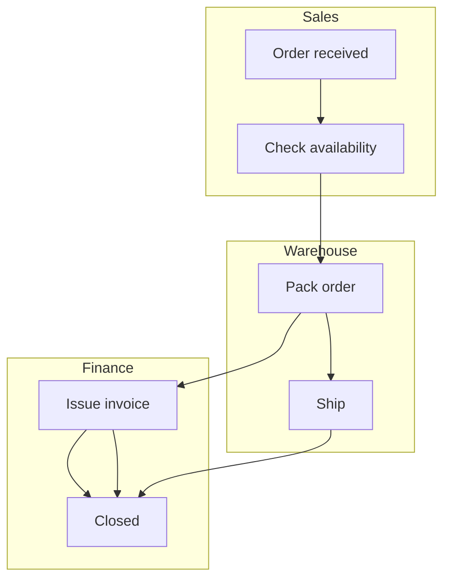

# LaneFlow

> A lightweight, text-based notation for process diagrams **with lanes**.
> Think Mermaid, but designed from the ground up for swimlanes.

**Status:** v0.1 — Draft specification. No parser/renderer yet.
**License:** Specification under [CC BY 4.0](LICENSE). Future code will be MIT.

---

## Why LaneFlow?

Mermaid.js is great for flowcharts and sequence diagrams, but it has **no
native swimlane notation**. The common workaround — abusing `subgraph` inside
a flowchart — breaks down as soon as a process grows beyond a handful of
steps, and there is no concept of *message flow* between participants.

Existing alternatives are either:

- **BPMN 2.0** — powerful but heavy. XML-based, dozens of element types,
  hard to write by hand, painful in code review.
- **PlantUML activity diagrams** — closer, but require a separate Java
  toolchain and don't model cross-lane communication cleanly.

LaneFlow fills the gap with a small, regular, diff-friendly syntax:

```laneflow
laneflow v0.1

lane Sales      "Sales"
lane Warehouse  "Warehouse"

Sales:     start  (Order received)
Sales:     check  [Check availability]
Warehouse: pack   [Pack order]
Sales:     done   ((Closed))

start --> check
check --> pack
pack  --> done
```

`Sales: check --> pack` crosses a lane boundary, so the parser classifies
it as a **message flow** automatically. The author never declares it.

### Before / after

A three-lane order process in Mermaid (workaround with `subgraph`):



The same process in LaneFlow:

```laneflow
laneflow v0.1

lane Sales
lane Warehouse
lane Finance

Sales:     start    (Order received)
Sales:     check    [Check availability]
Warehouse: pack     [Pack order]
Warehouse: ship     [Ship]
Finance:   invoice  [Issue invoice]
Finance:   done     ((Closed))

start --> check --> pack --> ship
pack --> invoice --> done
ship --> done
```

Lanes are first-class. Order of declaration is the order on the diagram.
Cross-lane arrows are message flow. The file diffs cleanly when the
process changes.

---

## Design principles

LaneFlow targets two audiences equally: humans reviewing diagrams in pull
requests, and **LLMs generating diagrams from natural-language sources**
(e.g. parsing a process description out of a PDF).

That second audience drives the most important design rule:

> **One way to express each thing.** Regularity beats sugar.

Concretely:

- Sections appear in a **fixed order**: header → (direction) → lanes →
  nodes → flows.
- Lanes MUST be declared up front.
- Nodes have explicit ids; flows reference ids, not labels.
- Sequence vs. message flow is **derived**, never declared.
- No optional shorthand that creates two ways to write the same thing.

---

## Quick reference

| You want…                       | You write…              |
|---------------------------------|-------------------------|
| Start / intermediate event      | `(text)`                |
| End event                       | `((text))`              |
| Task / activity                 | `[text]`                |
| Decision gateway                | `<text>`                |
| Declare a lane                  | `lane Sales "Sales"`    |
| Declare a node                  | `Sales: check [Check]`  |
| Plain arrow                     | `a --> b`               |
| Labeled arrow                   | `a -- yes --> b`        |
| Comment                         | `# anything`            |

The full grammar lives in [`docs/grammar.ebnf`](docs/grammar.ebnf) and the
formal specification in [`SPEC.md`](SPEC.md).

---

## Repository layout

```
SPEC.md                  Formal specification (normative)
docs/grammar.ebnf        Grammar — source of truth for syntax
docs/DESIGN_DECISIONS.md ADR-style log of why the syntax is what it is
examples/                Worked .laneflow examples
CONTRIBUTING.md          How to propose changes (RFC process)
CODE_OF_CONDUCT.md       Community standards
CHANGELOG.md             Versioned spec history
LICENSE                  CC BY 4.0 (specification & docs)
```

---

## Roadmap

LaneFlow is being built in three steps. **Only Step 1 is in scope for this
repository right now.**

- **Step 1 — Specification (current).** Lock down the v0.1 syntax,
  publish the spec and worked examples, set up the RFC process. No code.
- **Step 2 — AI authoring guide.** Materials that let assistants like
  Claude Code reliably generate and read LaneFlow: an instruction sheet,
  a skill, few-shot examples, error-recovery patterns.
- **Step 3 — PDF → LaneFlow.** Guidance for tooling that extracts a
  process description from a PDF and produces a valid LaneFlow document.

When LaneFlow gains a reference parser, it will live in this repository
under an `impl/` (or similar) directory and ship under the MIT license.
The specification itself stays under CC BY 4.0 regardless.

---

## Contributing

LaneFlow is intentionally small. Changes to the standard go through a
lightweight RFC process — see [`CONTRIBUTING.md`](CONTRIBUTING.md). Bug
reports against the specification (ambiguities, contradictions, missing
error cases) are very welcome; use the `Spec bug` issue template.

---

## License

This specification and all documents in this repository are licensed
under the [Creative Commons Attribution 4.0 International License
(CC BY 4.0)](LICENSE). You are free to share and adapt, including
commercially, as long as you give appropriate credit.
